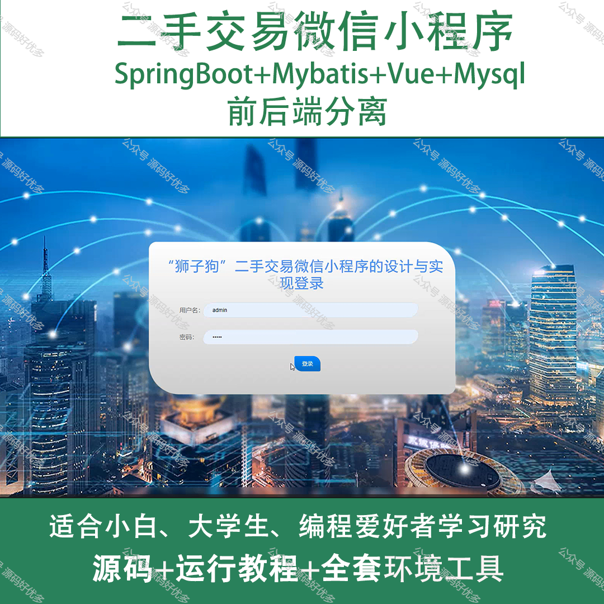
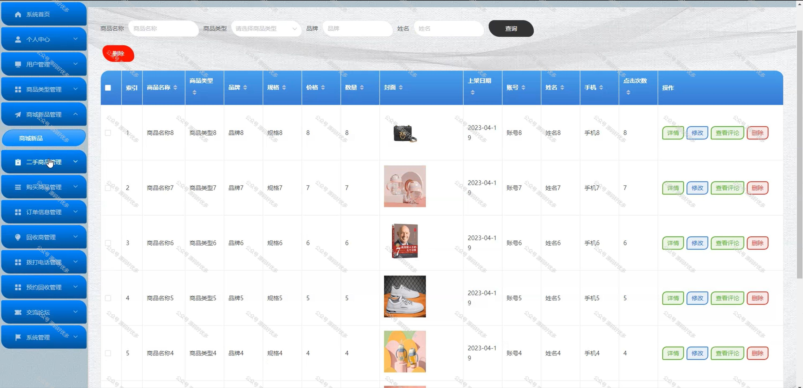
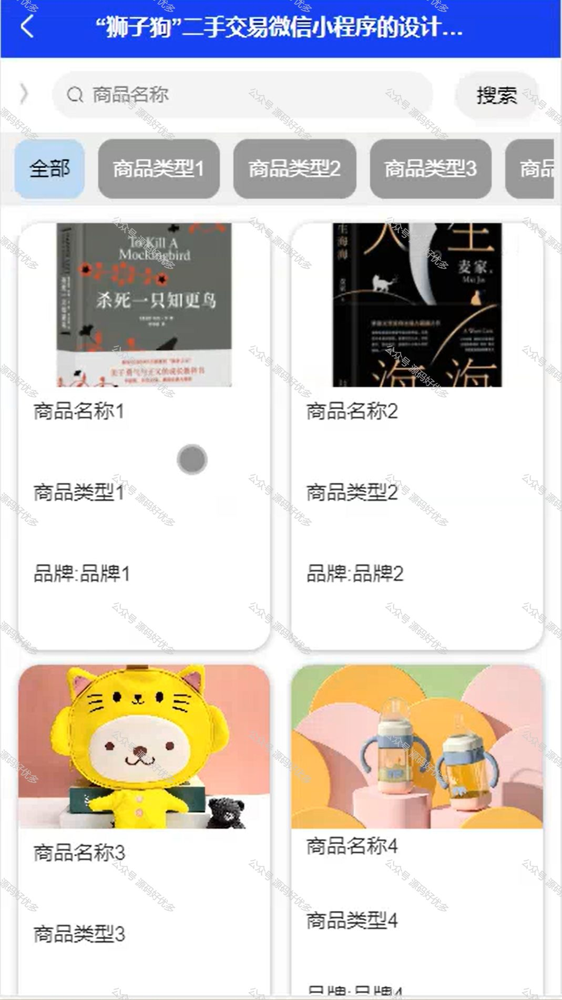
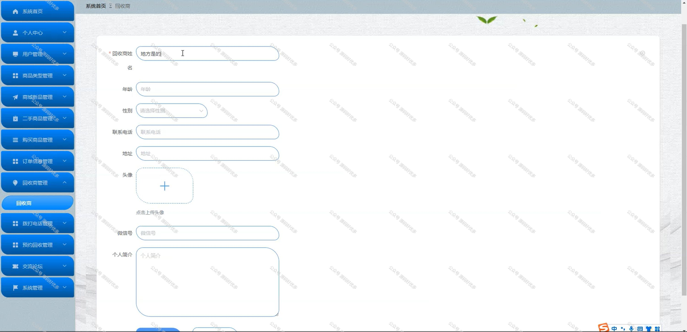
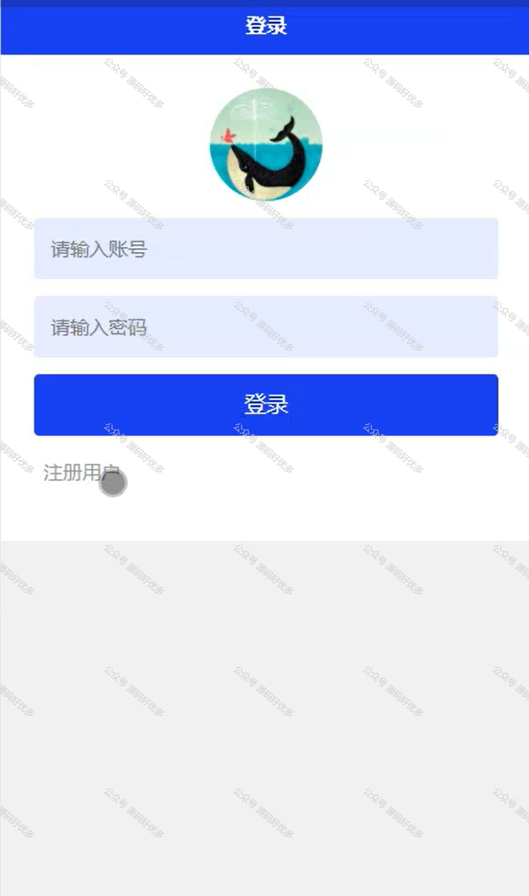
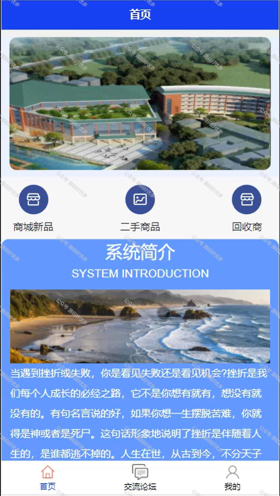
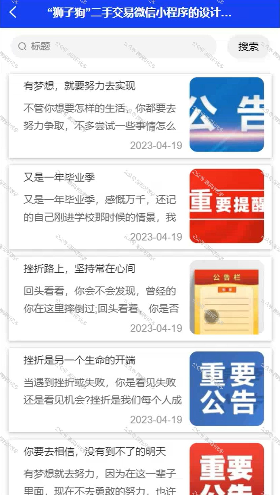
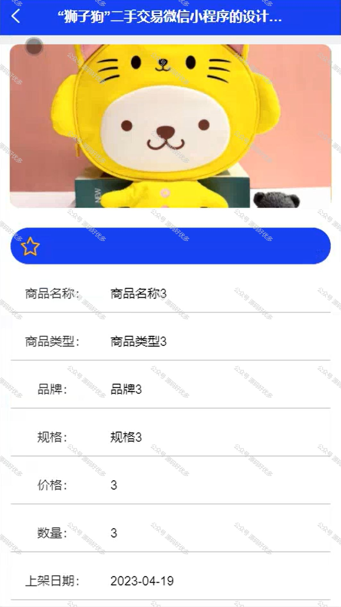
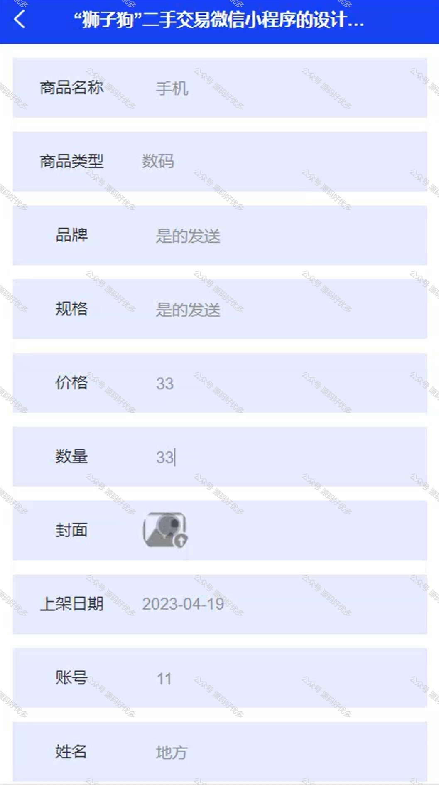
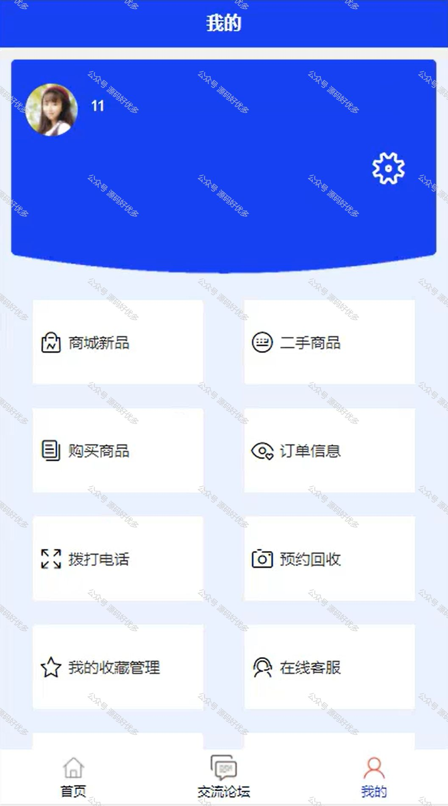

 
## 查看主页获取源码

> **作者介绍**： **✌**全网粉丝10W+本平台特邀作者、博客专家、CSDN新星计划导师、java领域优质创作者,博客之星、掘金/华为云/阿里云/InfoQ等平台优质作者、专注于项目实战 **✌**

  

### 一、作品包含

源码+数据库+全套环境和工具资源+部署教程

### 二、项目技术

前端技术：Html、Css、Js、Vue、Element-ui

数据库：MySQL

后端技术：Java、Spring Boot、MyBatis

  

### 三、运行环境

开发工具：IDEA/eclipse + 微信开发者工具

数据库：MySQL5.7

数据库管理工具：Navicat10以上版本

环境配置软件： JDK1.8+Maven3.6.3

前端Nodejs：14

### 四、项目介绍
项目编号：mpweixinA007

二手交易微信小程序是一种便捷的在线交易平台，它为用户提供了发布、浏览和购买二手商品的服务。通过这个小程序，用户可以轻松地处理闲置物品，实现资源的再利用，同时享受到更加环保和经济的消费方式。小程序通常具备商品发布、分类浏览、即时沟通和交易管理等基本功能，极大地方便了用户的二手交易体验。

前台用户功能：首页、交流论坛、个人中心、商城新品、二手商品、购买商品、订单信息、拨打电话、预约回收、我的收藏管理、在线客服、我要发贴、我的发帖

后台管理员的功能：系统首页、个人中心、用户管理、商品类型管理、商城新品管理、二手商品管理、购买商品管理、订单信息管理、回收商管理、拨打电话管理、预约回收管理、交流论坛和系统管理。

### 五、运行截图

  
